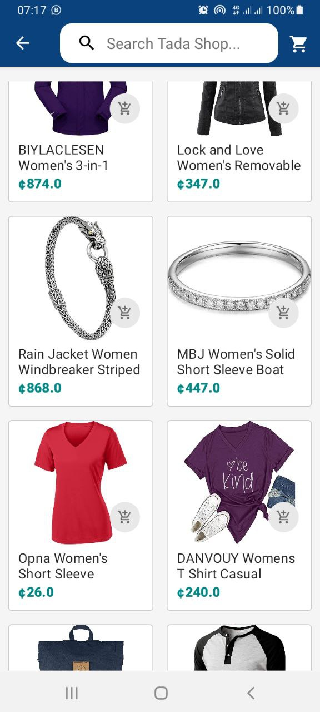

# Shopping Android App
A mini e-commerce android application written in Kotlin where users can start selling without investing any capital. 


## Overview
The application contains list of products such as shoes, clothings, electronic gadgets on which user can click to view its details and then, add them to cart. User can browse through a list of all products as well as browse base on category. Also, User can sell products, if he/she signed up as a Seller.
Some other features are as following:
- Login / Signup .
- Recyclerview with variable span size to show products.
- Product detail screen with image carousel 
- Share product to other apps with its images, description and be able to edit the price of the product before sharing
- See all orders placed.
- Increase/Decrease quantity of product in cart.
- Track orders with a button click that takes the user to a chat conversation on WhatsApp.


## Some Screenshots

|             Splash Screen            |             Welcome              |           Register            |
| :----------------------------------: | :---------------------------------------: | :----------------------------------:|
|  |  |  |

|                 Login             |                Home              |        Categories         |
| :---------------------------------: | :-------------------------------: | :------------------------------:|
|  |  |  |

|             Products            |             Product Detail              |           Share            |
| :----------------------------------: | :---------------------------------------: | :----------------------------------:|
|  |  |  |

|                 Choose App             |                WhatsApp Share              |        Shopping Cart         |
| :---------------------------------: | :-------------------------------: | :------------------------------:|
|  |  |  |

|                 Order Status           
| :---------------------------------: | 
|  |


## Project Setup

### Clone and install

Clone this repository and import into Android Studio
```
git clone https://github.com/terewere/tada-shop.git
```


## Built With
- Kotlin
- Coroutine
- MVVM
- Paging 3
- Room
- Dagger 2
- Material
- Picasso
- Retrofit

### BACKEND
- url - https://ks.ownaradio.com/api
- Laravel PHP
- Nginx
- Let’s Encrypt (SSL certificate) 


---

<p align="center"> Made with :blue_heart: by <a href="https://github.com/terewere">Shaibu Zachariyya</a></p>
